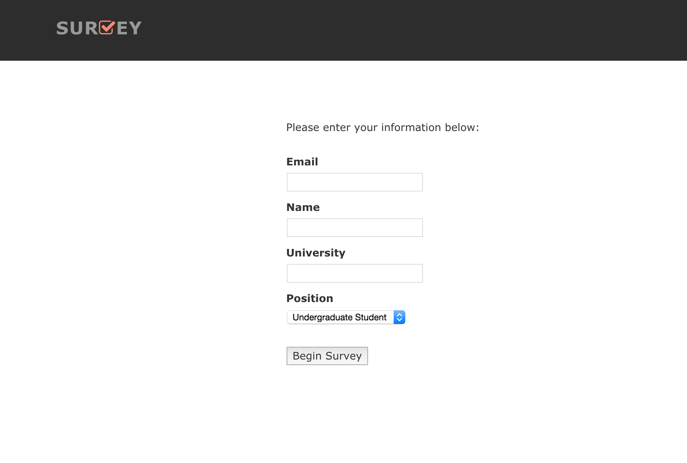

###Search Survey 

This repository contains source code for creating a web app that allows users to identify search results that are relevant for a given query. 

###Quickstart

<pre><code>git clone https://github.com/duhaime/survey  
cd survey  
rake db:drop db:create db:migrate db:seed  
rails server</code></pre>

If you navigate to localhost:3000, you should see the home page of the app:

After clicking Begin, users are prompted for a few pieces of identifying information:

Once this information is submitted, users are presented with a series of searches and their search results, and are asked to check all search results that seem relevant:

After one or more users have assessed the relevancy of one or more search results, one can view the user responses by navigating to localhost:3000/graph/show

###Data Model

When user's click the "Begin" button on the site's initial page, they will enter their relevant information in a series of fields. The system will then assign the user a `search_group_id`, which designates one or more queries for which the user will evalaute search results.  

Search results are fed into the app as `.ris` files, all of which are stored in `db/exported_search_files/`. The filenames of these ris files must follow the following conventions:  

`{n}_{q}.ris`, where {n} designates the "search group" to which a search belongs, and {q} represents the query used to generate the results. Each search group is merely a collection of ris files that should be served to each user with the corresponding search_group_id.  

